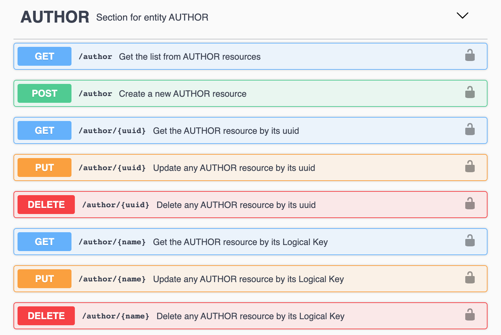
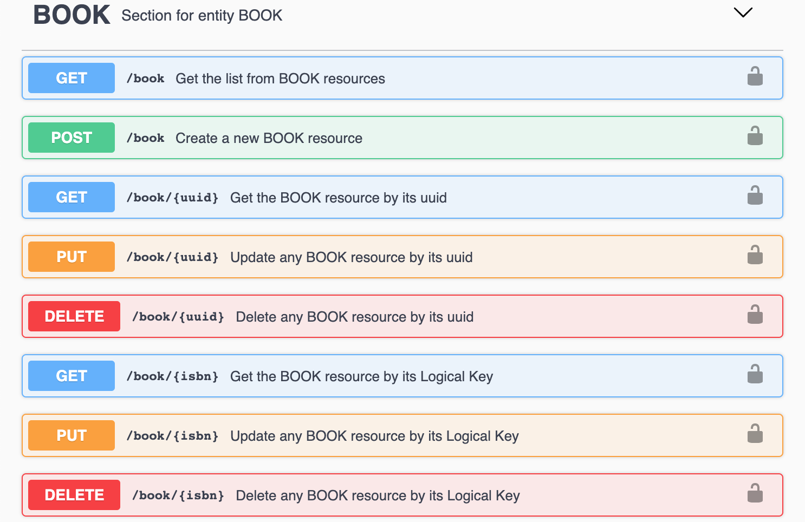

# Entities and REST APIs

### **Entities**

Entities are one the most important element of Gemini and can be defined by using the **ENTITY** keyword. They defines:

* REST Resources routes and default CRUD controllers
* Body Fields and their type
* Entity Resource Record Logical Key \(with the symbol **\*** \)


Each Gemini module can contain a schema definition. For example CORE and AUTH contains entities that are needed by the Framework to run and to setup authentication.

RUNTIME module is always available ad it is mainly used to work with Gemini as a [Zero Code Platform](../quickstart-and-setup/start-gemini/zero-code-platform.md) 



Following the section [Gemini as Dependency](../quickstart-and-setup/start-gemini/gemini-as-dependency.md) you can add your own custom modules and integrate Gemini in your Spring Project


### APIs

So with the previous definition Gemini automatically create the following **REST resources.**  


Note that the each resource can be consumed by its **uuid** and its **logical key. UUID** are automatically created by the POST method when you create the resource.


