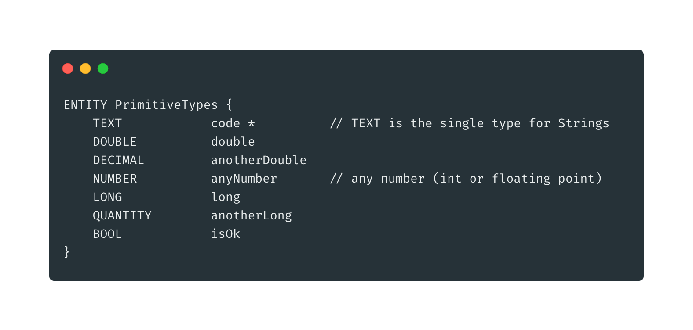

# Primitive Types

Primitive types are numbers, strings booleans and their aliases.

### **Numbers**

In Json notation _Number_ is a single type. In Gemini it is the same, but it adds some semantic to each field \(useful for validation\)

* **DOUBLE** or **DECIMAL**: floating point numbers
* **LONG** or **QUANTITY**: integer numbers
* **NUMBER**: any number no matter if it has decimals or not


_they may be extended in next releases \(for example adding only naturals numbers and so on\)_


### **Strings and Text**

Any string field can be defined with the **TEXT** type. No matter its size, it is a JSON string.

### **Boolean**

Boolean is _true_ or _false_ and can be defined with the **BOOL** type

