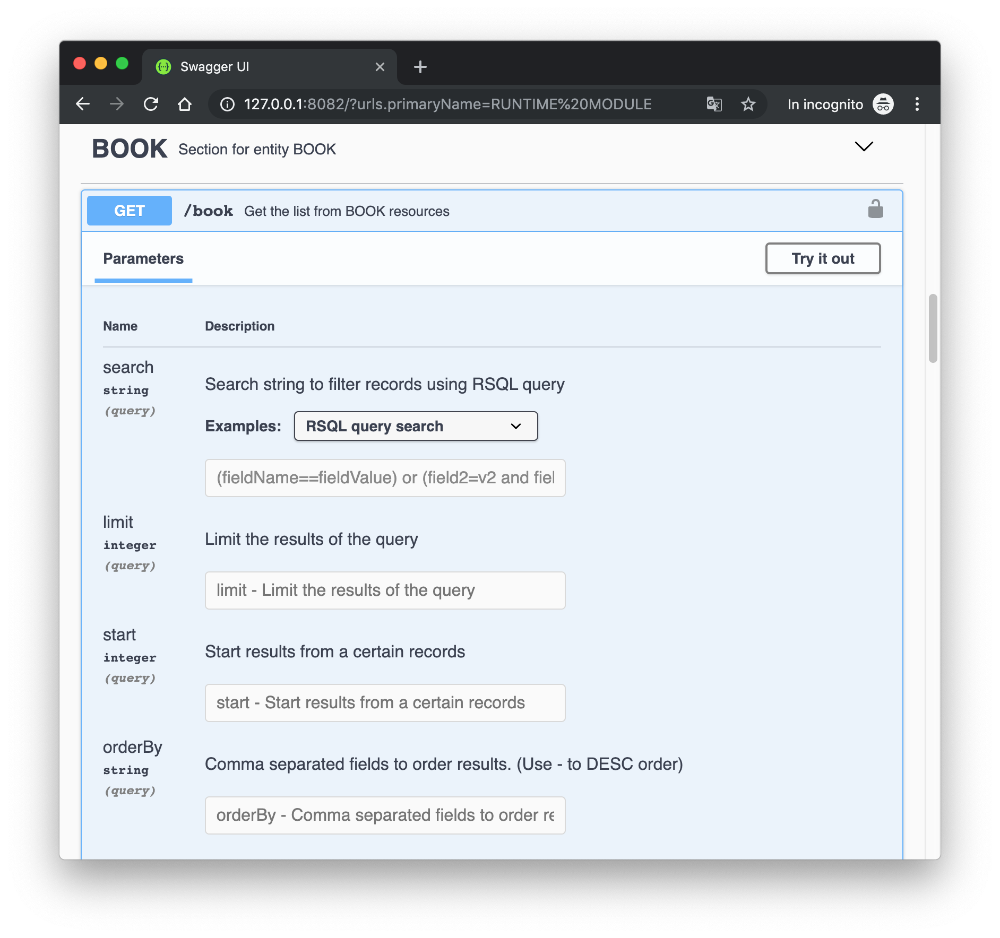

# API Filter and Sort

Each Entity has the root API that can be used to retrieve a list of entity records belonging to the entity. The following are fundamentals query string parameters you can use to search a filter data:

<table>
  <thead>
    <tr>
      <th style="text-align:left">Name</th>
      <th style="text-align:left">Description</th>
    </tr>
  </thead>
  <tbody>
    <tr>
      <td style="text-align:left">search</td>
      <td style="text-align:left">
        
Search string to filter records by using <a href="https://github.com/jirutka/rsql-parser">RSQL query</a>.
          Example:

        
<em>search=name==Andrea and age&gt;=20</em>
        

      </td>
    </tr>
    <tr>
      <td style="text-align:left">limit</td>
      <td style="text-align:left">limit the result of the query</td>
    </tr>
    <tr>
      <td style="text-align:left">orderBy</td>
      <td style="text-align:left">comma separated strings to order result by entity fields</td>
    </tr>
    <tr>
      <td style="text-align:left">start</td>
      <td style="text-align:left">if you order and limit query result you could want to perform multiple
        request to retrieve different data. start can be used as the offset for
        the already queries data</td>
    </tr>
  </tbody>
</table>#### Swagger & OpenAPI

OpenAPI documentation already provide the previous parameters for each resource. So the better way to understand how them works is to try.

