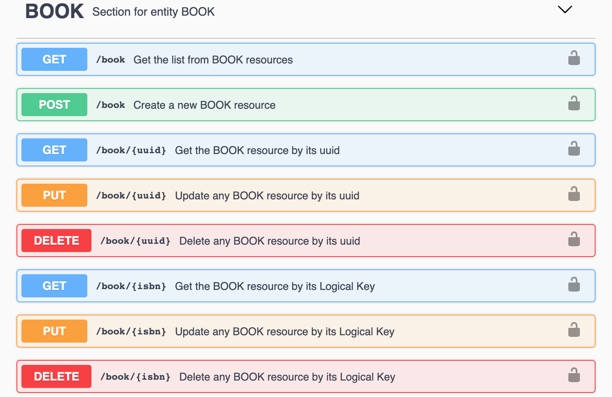

# UUID V3

Gemini Entity Manager automatically create a unique ID for each inserted record by using UUID-v3. They are a special type of unique identifier that are deterministic and generated starting from the Entity Record Logical Key \(that is unique in all the system\).


If you want to know more about UUID-v3 take a look at this article  
[Rest API: UUID-V3 is the right way](https://medium.com/@h4t0n/rest-api-uuid-v3-is-the-right-way-3ca0695610dc)


UUID-v3 are useful to synchronize data between environments and to be used also in REST APIs. Gemini provide also the UUID endpoint for each entity resource in addition to logical key. For example a Book can be retrieved both starting from the isbn \(logical key\) and its UUID.


**What about logical key changes?**

Gemini automatically recompute the UUID if its logical key change.


