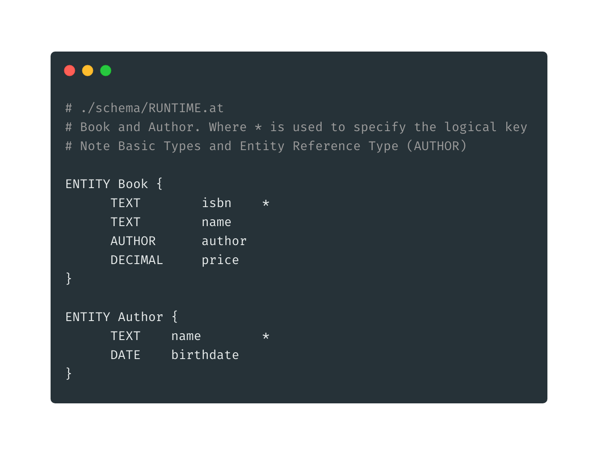

# Enjoy with DSL and REST


If you followed the [Start Gemini ](start-gemini/)and [ZeroCodePlatform](start-gemini/zero-code-platform.md) section Gemini has already configured its internal structures and has created the _**schema/RUNTIME.at**_ abstract type file in the working directory. 



If you followed the [Gemini as Dependency](start-gemini/gemini-as-dependency.md) section you can use your custom module _**schemas**_ file \(inside Java resources folder\), for example: _**schemas/CUSTOMMODULE.at**_


### DSL

Now you can customize the runtime file \(or your custom module schema file\) with all your entities by using the Gemini DSL. Then restart the application to see your APIs in action. Gemini automatically recognize what you have added/modified. For example:

### SWAGGER

If you want to easily navigate APIs you can use the Swagger openapi tools. Gemini automatically generate the **openapi** json file `openapi/schema/runtime.json`. For example you can navigate the _Book_ and _Author_ sections.


Note that entity can be consumed both by their _**logical key**_ and by the _**unique UUID**_ generated when you create a resource with POST



If you want customize openapi information you can change the autogenerated default properties of _**./service/info.yml .**_ Than restart Gemini to make changes working.


